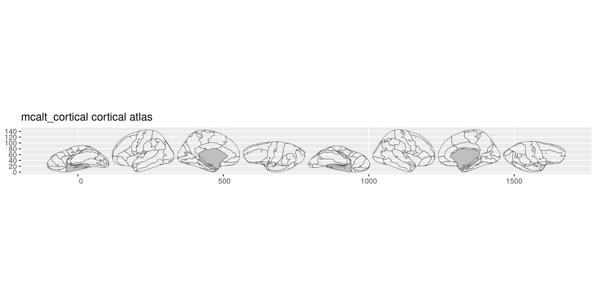
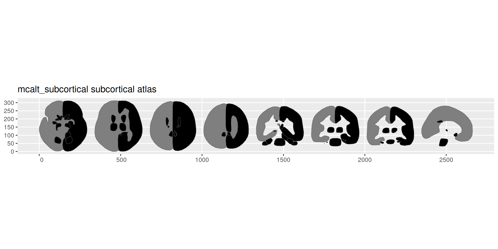

<!-- README.md is generated from README.qmd. Please edit that file -->

# ggsegMcalt

<!-- badges: start -->

[](https://github.com/ggsegverse/ggsegMcalt/actions/workflows/R-CMD-check.yaml)
[](https://ggseg.r-universe.dev/ggsegMcalt)
<!-- badges: end -->

MCALT (Mayo Clinic Adult Lifespan Template) atlas for the ggseg
ecosystem.

## Installation

We recommend installing the ggseg-atlases through the ggseg
[r-universe](https://ggseg.r-universe.dev/ui#builds):

``` r
options(repos = c(
  ggseg = "https://ggseg.r-universe.dev",
  CRAN = "https://cloud.r-project.org"
))

install.packages("ggsegMcalt")
```

You can install this package from [GitHub](https://github.com/) with:

``` r
# install.packages("pak")
pak::pak("ggsegverse/ggsegMcalt")
```

## Cortical atlas

``` r
library(ggseg)
library(ggsegMcalt)

plot(mcalt_cortical())
```



## Subcortical atlas

``` r
plot(mcalt_subcortical())
```



## Data source

Schwarz CG et al. (2017). The Mayo Clinic Adult Lifespan Template
(MCALT): Better quantification across the lifespan. *Alzheimer’s &
Dementia*, 13(7), P93-P94.
[doi:10.1016/j.jalz.2017.06.1071](https://doi.org/10.1016/j.jalz.2017.06.1071)
