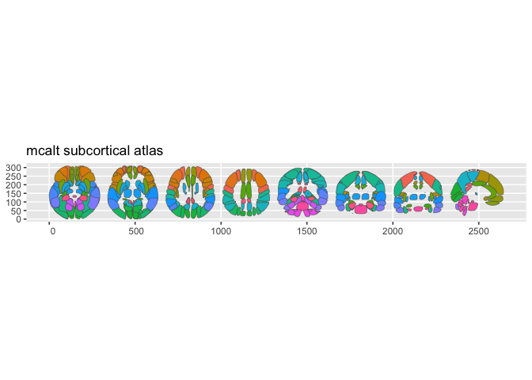

<!-- README.md is generated from README.Rmd. Please edit that file -->

# ggsegMcalt

<!-- badges: start -->

[](https://github.com/ggsegverse/ggsegMcalt/actions/workflows/R-CMD-check.yaml)
[](https://ggsegverse.r-universe.dev/ggsegMcalt)
<!-- badges: end -->

MCALT Atlas for the ggsegverse Ecosystem.

## Installation

``` r
# From r-universe
install.packages("ggsegMcalt", repos = "https://ggsegverse.r-universe.dev")

# From GitHub
# install.packages("remotes")
remotes::install_github("ggsegverse/ggsegMcalt")
```

## Atlases

### mcalt

Mayo Clinic Adult Lifespan Template ADIR122 parcellation.

``` r
library(ggsegMcalt)
plot(mcalt())
```

 \##
Data source

[NITRC](https://www.nitrc.org/projects/mcalt/).

- **Reference**: Schwarz et al. (2017)
  [doi:10.1016/j.jalz.2017.06.1071](https://doi.org/10.1016/j.jalz.2017.06.1071)

- **Date obtained**: 2026-03-28
